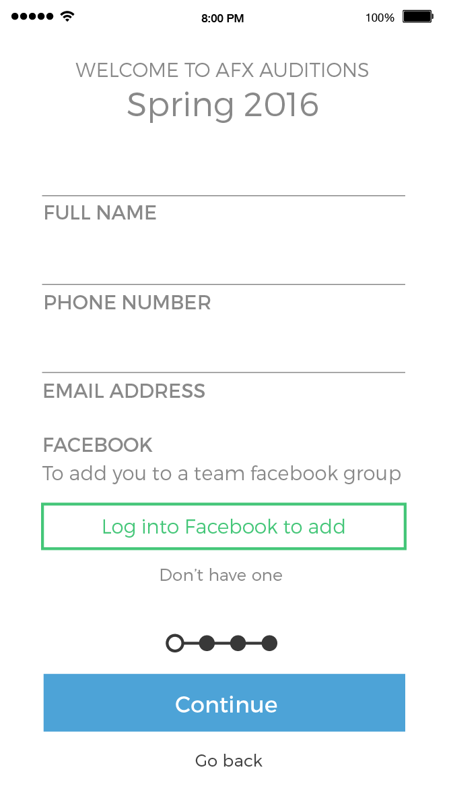
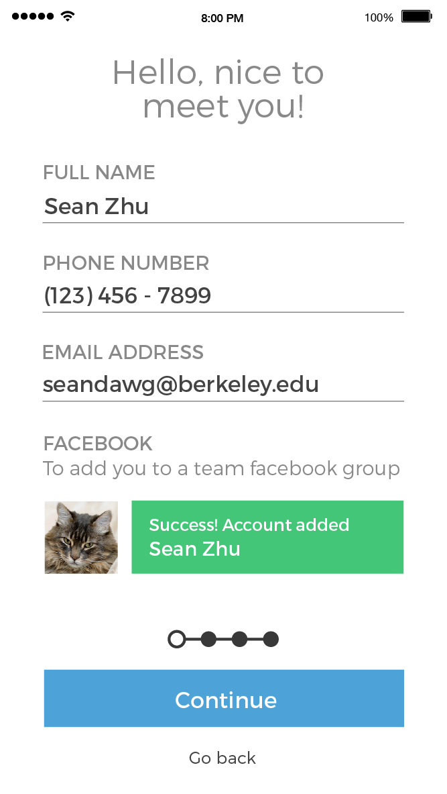
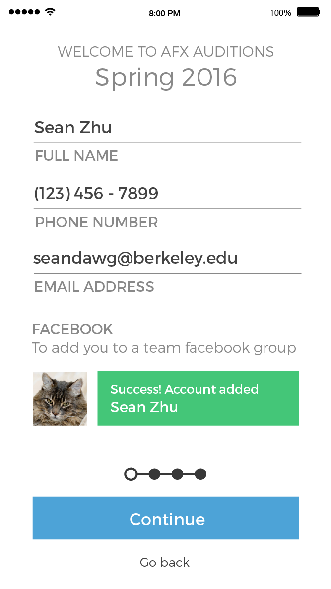
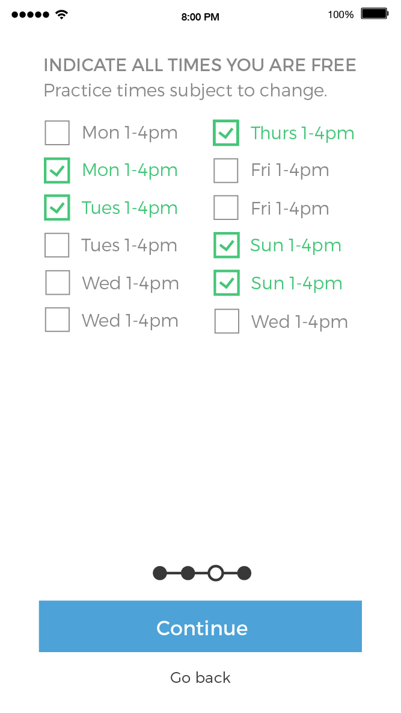
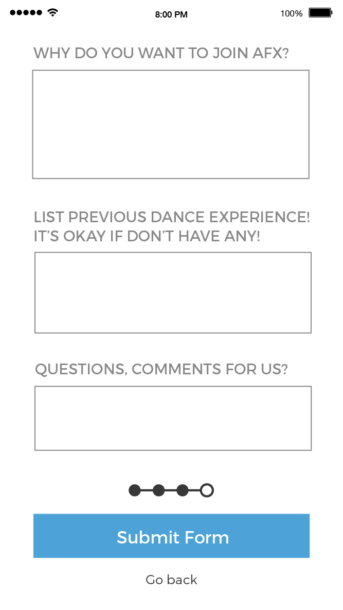
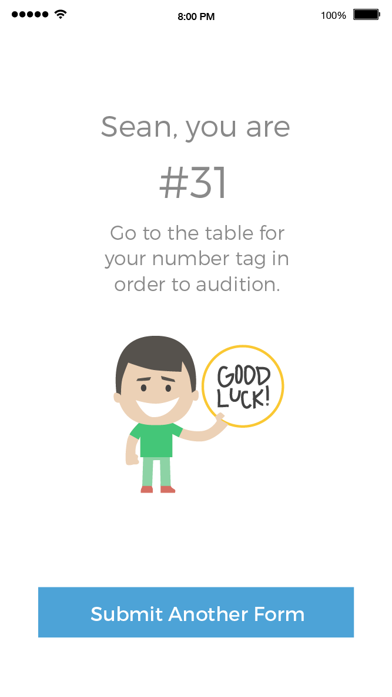

<table>
  <thead>
    <tr>
      <th></th>
      <th>Version 1</th>
      <th>Version 2</th>
    </tr>
  </thead>
  <tbody>
    <tr>
      <td>Step 1: Contact info</td>
      <td></td>
      <td></td>
    </tr>
    <tr>
      <td>Step 1b: Facebook</td>
      <td></td>
      <td></td>
    </tr>
    <tr>
      <td>Step 2: Demographics</td>
      <td></td>
      <td></td>
    </tr>
    <tr>
      <td>Step 3: Availability</td>
      <td></td>
      <td></td>
    </tr>
    <tr>
      <td>Step 4: Free response</td>
      <td></td>
      <td></td>
    </tr>
    <tr>
      <td>All done!</td>
      <td></td>
    </tr>
  </tbody>
</table>
